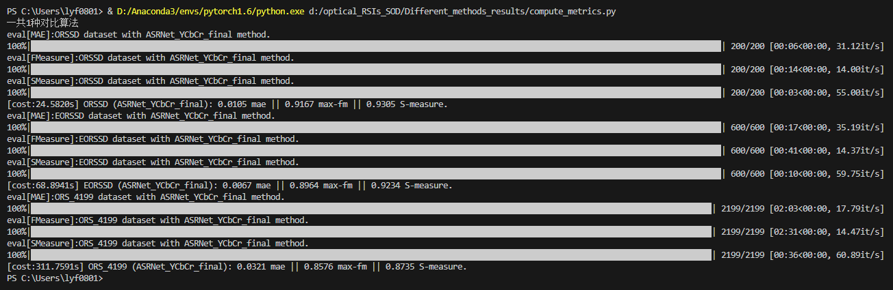

# SRAL
This repository is about the work "[**Distilling Knowledge From Super-Resolution for Efficient Remote Sensing Salient Object Detection**](https://ieeexplore.ieee.org/abstract/document/10102592/)" in **IEEE TGRS 2023**.

# Abstract
<p style="text-align:justify; text-justify:inter-ideograph;">
Current state-of-the-art remote sensing salient object detectors always require high-resolution spatial context to ensure excellent performance, which incurs enormous computation costs and hinders real-time efficiency. In this work, we propose a universal super-resolution-assisted learning (SRAL) framework to boost performance and accelerate the inference efficiency of existing approaches. To this end, we propose to reduce the spatial resolution of the input remote sensing images (RSIs), which is model-agnostic and can be applied to existing algorithms without extra computation cost. Specifically, a transposed saliency detection decoder (TSDD) is designed to upsample interim features progressively. On top of it, an auxiliary SR decoder (ASRD) is proposed to build a multitask learning (MTL) framework to investigate an efficient complementary paradigm of saliency detection and SR. Furthermore, a novel task-fusion guidance module (TFGM) is proposed to effectively distill domain knowledge from the SR auxiliary task to the salient object detection task in optical RSIs. The presented ASRD and TFGM can be omitted in the inference phase without any extra computational budget. Extensive experiments on three datasets show that the presented SRAL with 224×224 input is superior to more than 20 algorithms. Moreover, it can be successfully generalized to existing typical networks with significant accuracy improvements in a parameter-free manner.
</p>


# Framework


# Experimental Results


# How to use this repository

## Directly download predicted saliency maps from zip files for comparison
```
predict_smaps_ASRNet_YCbCr_final_ORSSD.zip
predict_smaps_ASRNet_YCbCr_final_EORSSD.zip
predict_smaps_ASRNet_YCbCr_final_ORS_4199.zip
```

## Runing source code to generate the predicted saliency maps

### 1. Install newest versions of torch and torchdata
```python
thop                      0.0.31
tqdm                      4.59.0
numpy                     1.20.2
timm                      0.4.12
tokenizers                0.12.1
torch                     1.8.1
torchvision               0.9.1
```

### 2. Download weights files from Google Drive
<https://drive.google.com/drive/folders/1g0t9cyREKtLUfzDPNROOXOEM8xudoNOo?usp=drive_link>

### 3. Run getsmaps.py to generate the saliency maps
```python
python getsmaps.py
```

### 4. Run compute_metrics.py to calculate the qualititive results
```python
python compute_metrics.py  # in  ./compute_results
```


# Citation (if possible, please cite:)
```BibTeX
@ARTICLE{SRAL2023,

  author={Liu, Yanfeng and Xiong, Zhitong and Yuan, Yuan and Wang, Qi},
  
  journal={IEEE Transactions on Geoscience and Remote Sensing}, 
  
  title={Distilling Knowledge From Super-Resolution for Efficient Remote Sensing Salient Object Detection}, 
  
  year={2023},
  
  volume={61},
  
  number={},
  
  pages={1-16},
  
  doi={10.1109/TGRS.2023.3267271}
  
  }

@ARTICLE{HFANet2022,

  author={Wang, Qi and Liu, Yanfeng and Xiong, Zhitong and Yuan, Yuan},

  journal={IEEE Transactions on Geoscience and Remote Sensing},

  title={Hybrid Feature Aligned Network for Salient Object Detection in Optical Remote Sensing Imagery},

  year={2022},

  volume={60},

  number={},

  pages={1-15},

  doi={10.1109/TGRS.2022.3181062}

}

@ARTICLE{SDNet2023,

  author={Liu, Yanfeng and Xiong, Zhitong and Yuan, Yuan and Wang, Qi},
  
  journal={IEEE Transactions on Geoscience and Remote Sensing}, 
  
  title={Transcending Pixels: Boosting Saliency Detection via Scene Understanding From Aerial Imagery}, 
  
  year={2023},
  
  volume={61},
  
  number={},
  
  pages={1-16},

  doi={10.1109/TGRS.2023.3298661}

  }

@ARTICLE{UG2L2023,

  author={Liu, Yanfeng and Yuan, Yuan and Wang, Qi},

  journal={IEEE Geoscience and Remote Sensening Letters},

  title={Uncertainty-Aware Graph Reasoning with Global Collaborative Learning for Remote Sensing Salient Object Detection},

  year={2023},

  volume={20},

  number={},

  pages={1-5},

  doi={10.1109/LGRS.2023.3299245}

}

@InProceedings{RSSOD2023,

  author = {Xiong, Zhitong and Liu, Yanfeng and Wang, Qi and Zhu, Xiao Xiang},

  title = {RSSOD-Bench: A Large-Scale Benchmark Dataset for Salient Object Detection in Optical Remote Sensing Imagery},

  booktitle = {Proc. IEEE International Geoscience and Remote Sensing Symposium (IGARSS)},

  pages={6549-6552},

  year = {2023}

}
```

# Acknowledgment and our other works
1. <https://github.com/EarthNets/Dataset4EO>
2. <https://github.com/lyf0801/UG2L>
3. <https://github.com/lyf0801/SDNet>
4. <https://github.com/lyf0801/HFANet>
5. <https://github.com/rmcong/DAFNet_TIP20>
6. <https://github.com/rmcong/EORSSD-dataset>
7. <https://github.com/rmcong/ORSSD-dataset>
